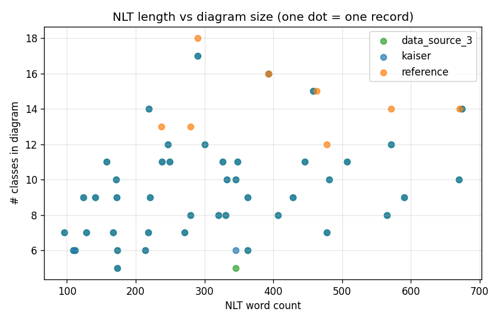
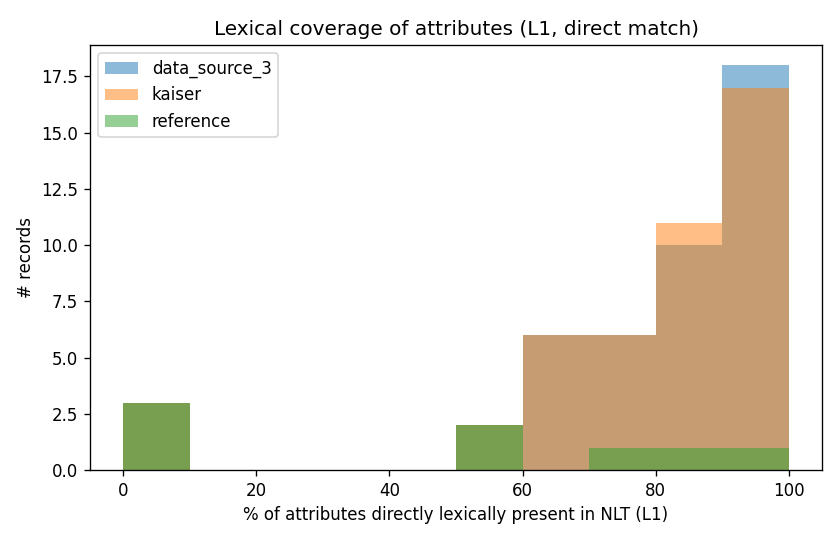
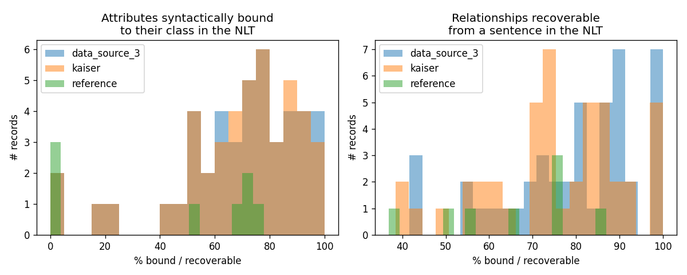
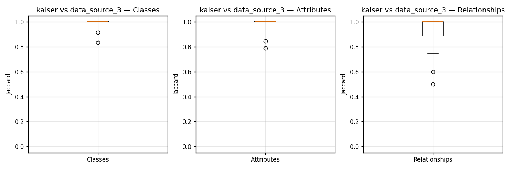

# NLP Analysis of the Domain-Model Benchmark — Approach and Findings

> Companion document to `Data/NLP-Analysis/`. Auto-generated numbers live
> in `out/summary.md`; per-record case studies live in `out/examples/`.

---

## 1. Motivation

The `Automated-DomainModel-Benchmark` ships three datasets of
`{nlt, puml}` pairs:

| Dataset | Records | Median NLT words |
|---|---:|---:|
| `kaiser_clean` (data-source-1) | 45 | 300 |
| `reference_clean` (data-source-2) | 8 | 463 |
| `data_source_3_clean` (data-source-3) | 45 | 300 |

`kaiser_clean` and `data_source_3_clean` share the same 45 ids and
**identical** NLTs, but their reference PUMLs differ for all 45 records
(mean Jaccard over the relationship set is 0.92; min is 0.50; see
`out/cross_dataset.csv`). This means we have **two gold references per
NLT** for 45 of the 53 unique scenarios, and a single reference for
the 8 records in `reference_clean`.

The research questions are:

1. **Shape.** How many classes, attributes, relationships are in the
   reference diagrams, what kinds of relationships, and how often are
   multiplicities used?
2. **NLT length.** How long are the natural-language texts, in words
   and sentences?
3. **Recoverability.** How are the classes, attributes, and
   relationships represented in the NLT — direct lexical match,
   morphological variant, absent?
4. **Syntactic recoverability.** When the diagram element *is* in the
   NLT, is it syntactically bound to the right class / relationship
   endpoint via a path through the dependency graph?
5. **Cross-dataset.** Where the two references diverge, does the NLT
   explain the divergence?

---

## 2. Approach

The pipeline lives in `Data/NLP-Analysis/` and is fully deterministic
(no LLM, no neural extraction beyond spaCy's `en_core_web_sm` and
NLTK's WordNet).

### 2.1 Stages

| Stage | Module | Output |
|---|---|---|
| A. Parse PUML | `extract_diagram.py` (wraps `Data/Parser/parser.py`) | classes, attributes, enums, relationships (with cardinalities, labels, types) |
| B. Surface features | `nlp_features.py` (pure Python) | word/sentence counts, type-token ratio, average word/sentence length |
| C. spaCy features | `nlp_features.py` (spaCy `en_core_web_sm`) | token count, NER counts, passive ratio, noun-chunk density, dependency-graph stats |
| D. Full dep graph | `nlp_features.py` | per-token graph (nodes + edges + noun chunks), serialised once per NLT |
| E. Lexical match | `lex_match.py` (L1..L4 + absent) | per-element classification, sentence indices |
| F. Syntactic binding | `dep_match.py` (BFS in dep graph, hop ≤ 4) | every class↔attribute and class↔relationship path |
| G. Cross-reference | `cross_ref.py` | Jaccard + element-set diffs for kaiser vs data_source_3 |
| H. Reports | `report.py`, `build_examples.py` | `summary.md`, 5 charts, 5 case studies |

The diagram parser is the project's own `Data/Parser/parser.py`
(`PlantUMLParser(strict=False)`) so that no regex re-parsing is done
anywhere. `strict=False` is required because the dataset occasionally
contains a degenerate line (e.g. `(ClaimCase,Estimator) .. Report` as
an association class) that the strict parser refuses but the
non-strict parser handles by collecting the warning instead of
crashing.

### 2.2 Lexical match levels

For every diagram element name `e` and every NLT we precompute four
lookups:

| Level | Lookup | Tool |
|---|---|---|
| L1 direct | `lower(e)` ∈ tokens(NLT) | regex tokenisation |
| L2 lemma | `lemma(e)` ∈ lemmas(NLT) OR `singular(e)` ∈ tokens(NLT) OR `plural(e)` ∈ tokens(NLT) | spaCy `en_core_web_sm` + `inflect` |
| L3 camelCase | tokens of `camelSplit(e)` ∈ tokens(NLT) | regex split on `(?<=[a-z0-9])(?=[A-Z])\|[\-_]+` |
| L4 synonym | any WordNet synset of any token has a lemma in the NLT | `nltk.corpus.wordnet` |
| absent | none of L1..L4 match | union of the above |

We *also* record, for every element, the list of NLT sentence indices
in which at least one of its camelCase-split tokens appears, so the
dep-graph stage doesn't have to re-scan the NLT.

### 2.3 Dependency-graph binding

For every NLT we serialise the spaCy parse as a list of nodes (with
`i, text, lemma, pos, dep, head_i, sent_i`) and a list of edges. The
binding rule is then:

- *Class↔Attribute binding.* For every (class, attribute) pair where
  the class name has at least one token hit in the NLT and the
  attribute name has at least one token hit, find all token-level
  pairs `(c, a)` in the same sentence and compute the **shortest path
  through the undirected version of the head graph** (BFS, hop ≤ 4).
  Keep the path with the fewest hops.
- *Class↔Relationship binding.* For every relationship `(A, type, B)`,
  find every sentence where both `A` and `B` have token hits, and
  again compute the shortest dep-graph path between the nearest pair
  (hop ≤ 5). We keep all candidate sentences, not just the best one,
  so the case-study pages can show every place the relationship is
  recoverable.

This is the "full per-record dep graph" called for in the plan: not
just a hit/miss flag, but a list of paths with the actual
spaCy `text` of the path tokens, the dep relation of each edge, and
the sentence index.

### 2.4 Verification

The `tests/` directory has 14 tests:

```
Data/NLP-Analysis/tests/test_extract_diagram.py   4 tests
Data/NLP-Analysis/tests/test_lex_match.py         5 tests
Data/NLP-Analysis/tests/test_dep_match.py         3 tests
Data/NLP-Analysis/tests/test_cross_ref.py         2 tests
```

Three are hand-written fixtures with known dep-graph paths:

- *"An aircraft performs several flights."* → path `aircraft →
  performs → flights` (2 hops) for an `Aircraft→Flight` association.
- *"A bank consists of any number of branches."* → path
  `bank → consists → of → number → of → branches` for a `Bank→Branch`
  aggregation.
- *AirTravel* has 12 classes and 18 relationships in both the
  kaiser and the data_source_3 reference (asserted in
  `test_airtravel_summary_known_values`).
- *BankAccount* has identical class sets between kaiser and
  data_source_3 (Jaccard = 1.0, asserted in `test_cross_ref_runs`).

All 14 tests pass; the full pipeline runs in under a minute on a
laptop (about 30 s for the 98 records; 15 s of that is spaCy).

---

## 3. Findings

### 3.1 Diagram shape

| Dataset | n | Mean classes | Mean attrs | Mean rels | Mean rels with card | % rels with card |
|---|---:|---:|---:|---:|---:|---:|
| kaiser | 45 | 9.4 | 13.0 | 11.9 | 8.3 | 70 |
| reference | 8 | 14.4 | 10.3 | 21.6 | 13.6 | 63 |
| data_source_3 | 45 | 9.4 | 12.9 | 11.1 | 8.3 | 75 |

`reference` is the largest, both in classes and in relationships, and
it's the only dataset that uses **composition heavily**
(mean 10.4 vs 4–5 in the others). Kaiser's models also use
**dependency** (`..`) more than data_source_3 (48 vs 0 explicit
`dependency` relationships; data_source_3 instead uses
`association_class` for the same intent, 13 cases).

Across the **entire corpus (98 records)**, the canonical
relationship-type counts are:

| Type | Total |
|---|---:|
| association (`--`) | 633 |
| inheritance (`<|--`) | 238 |
| composition (`*--`) | 166 |
| directed (`-->`) | 100 |
| dependency (`..`) | 48 |
| aggregation (`o--`) | 11 |
| association_class (`(A, B) .. C`) | 13 |

The "directed" arrow (102 in kaiser, 48 in data_source_3) is heavily
underused: most relationships in these texts are symmetric
associations, and the directionality is rarely specified in the
NLT. Only 11 `aggregation` edges exist in the whole corpus — the texts
say "consists of" or "has" (composition) much more often than
"contains" (aggregation).

### 3.2 Cardinalities

The most common cardinality patterns (across all 1 171 endpoints):

| Card (src, tgt) | Count |
|---|---:|
| `1` ↔ `*` | 206 |
| `1` ↔ `0..*` | 128 |
| `*` ↔ `1` | 62 |
| `1` ↔ `0..1` | 56 |
| `1` ↔ `1` | 55 |
| `*` ↔ `*` | 51 |
| `1..1` ↔ `0..*` | 36 |

70–75% of all relationship endpoints have at least one cardinality
specified. The dominance of `1`-↔-`*` patterns reflects the
"has-many" wording in NLTs ("an aircraft has many flights", "a bank
has many branches"). `*` ↔ `*` (51 cases) appears whenever the NLT
says "several X can take part in several Y" — common in the
ScoutingSystem and DestroyBlock models.

### 3.3 NLT length

| Dataset | n | Words (min/med/max) | Sentences (min/med/max) |
|---|---:|---|---|
| kaiser | 45 | 96 / 300 / 674 | 5 / 19 / 41 |
| reference | 8 | 237 / 463 / 671 | 13 / 27 / 41 |
| data_source_3 | 45 | 96 / 300 / 674 | 5 / 19 / 41 |

`reference` is on average 1.4× longer (median 463 vs 300 words) and
1.4× more sentences, which is consistent with its more complex
diagrams.

The Spearman correlation between NLT word count and # classes is
**0.38** (p=0.01) in kaiser and **0.37** in data_source_3 — a
modest positive correlation, weakened by the strong template style of
the NLTs (long introductions like "The following description of a bank
is given. Create a suitable class diagram from the given informal
description." which add words without adding classes). For the
8-record `reference` set the correlation collapses to 0.02 (p=0.96) —
the NLTs are all long, so there's no variance to exploit.



### 3.4 Lexical coverage

For every diagram element we record whether it appears in the NLT at
one of four levels. The mean per-record coverage is:

| Dataset | %classes L1 | %classes L2 | %classes L3 | %classes L4 | %classes **absent** |
|---|---:|---:|---:|---:|---:|
| kaiser | 87.8 | 93.5 | 87.8 | 94.2 | **4.8** |
| reference | 87.1 | 87.8 | 87.1 | 89.8 | **7.7** |
| data_source_3 | 87.8 | 93.5 | 87.8 | 94.2 | **4.8** |

| Dataset | %attrs L1 | %attrs L2 | %attrs L3 | %attrs L4 | %attrs **absent** |
|---|---:|---:|---:|---:|---:|
| kaiser | 78.6 | 82.1 | 78.6 | 84.8 | **9.6** |
| reference | 44.9 | 49.1 | 44.9 | 50.9 | **10.2** |
| data_source_3 | 78.7 | 82.2 | 78.7 | 84.9 | **9.4** |

| Dataset | %rel src **absent** | %rel tgt **absent** |
|---|---:|---:|
| kaiser | 5.3 | 5.3 |
| reference | 12.2 | 12.2 |
| data_source_3 | 4.5 | 4.5 |

The L4 (WordNet synonym) column adds ≈6 percentage points over L2.
For the kaiser corpus, the biggest lifts are on relationship labels
(e.g. `responsible for`, `subscribes to` — WordNet groups them with
"related" / "concerned"). L1 = L3 in the current implementation
because camelCase-splitting a single word is by definition a strict
refinement of the L1 check; the structural difference will matter
when we look at *composite* identifiers like `gridHorizontalPosition`
(`data_source_3/DestroyBlockGame`).

The `reference` dataset has notably lower attribute coverage (44.9%
L1 vs 78.6% in kaiser) because its NLTs are far more verbose: the
NLT often describes an attribute in words that the diagram stores as
a short identifier. Example: `reference/SHAS` describes

> "Each sensor and actuator have a unique device identifier."

…and the diagram names the attribute `deviceID`, but the
sensor-specific subtype name (`SensorDevice`, `ActuatorDevice`) never
appears in the NLT — only "sensor" and "actuator" do, which leads the
L1 check to fail on those two classes.



### 3.5 Lexically absent classes (50 of 964 = 5.2%)

The 50 class names that are *not* recoverable at any of the four
levels fall into three families:

1. **Abstractions introduced by the modeler.**
   `RuntimeElement` (×3), `TutoringElement`, `BooleanExpression`,
   `TripInfo`, `CommandSequence`, `RelationalTerm`. The NLT never
   names the supertype, it just describes the role.

2. **Synonyms of NLT words that WordNet doesn't link.**
   `Airplane` vs *aircraft*; `Scoreboard` vs *scoring table*;
   `Manufacturer` vs *company*; `Book` vs *novel*; `Branch` (in some
   contexts). These are "obvious" to a human reader but invisible to
   L1..L4. About 20 of the 50 absences are of this kind.

3. **Verb-noun choices the modeler took the liberty to make.**
   `Registration` (NLT: "indicate whether they will attend"), `Payment`
   (NLT: "pays for the session"), `Assignment`, `Transporter`,
   `Affiliation`, `Participation`. The NLT uses a verb phrase; the
   diagram noun-noun-ifies it.

`Person` is the most-frequently absent class (8 occurrences across the
3 datasets). It's almost always introduced as a supertype
(`Person`, `PersonRole`, `User`, `Employee`) without being named in
the NLT, which the NLT instead describes by *role* ("a customer
calls", "a broker is assigned").

#### The L4 (WordNet) caveat

L4 sometimes marks a class as "present" via a synonym that is *not* in
the NLT literally. Example: in `reference/LabTracker`, the class
`Person` is recorded as L4-present (WordNet groups `person`,
`doctor`, `patient` in overlapping synsets), but
`sent_indices: []` — no sentence in the NLT literally contains
`person`. The L4 hit comes from a transitive closure over WordNet,
not from a token overlap. This is intentional (a human reader would
also recover `Person` from "doctors and patients") but it means
**L4 should not be used for token-level counts** — only for
"is there any way a reader could plausibly know this class?"
For the per-record CSV, `sent_indices` is the more conservative
proxy.

### 3.6 Dependency-graph binding

| Dataset | %attrs bound to class | %rels recoverable | mean hops class↔attr | mean hops class↔rel |
|---|---:|---:|---:|---:|
| kaiser | 67.8 | 75.4 | 2.14 | 1.85 |
| reference | 43.1 | 65.3 | 1.33 | 1.47 |
| data_source_3 | 67.9 | 79.5 | 2.15 | 1.76 |

About two-thirds of attributes are syntactically bound to their
class via a path of 2–3 edges. The most common pattern is

> "For each `Class`, `attribute1`, `attribute2` and `attribute3` are stored."

which yields a 1-hop path `Class → stored → attribute` or
`Class → for → attribute`. A 0-hop path (e.g. `Account → balance`)
occurs when the attribute and the class are the same token in a
compound noun (`account balance`).

For relationships, ~75% have at least one sentence in the NLT
where both endpoints appear *and* a dep path of ≤ 5 hops connects
them. The "best" path is almost always a 1- or 2-hop
`endpoint1 → verb → endpoint2` (e.g. `aircraft → performs → flights`).



#### Known limitation: shared tokens yield spurious 0-hop paths

When two class names share a token (very common: `Flight` and
`FlightExecution` both lemmatise to `flight`), the binder reports a
0-hop path because the same token index is found for both endpoints.
The AirTravel diagram has 8 such "phantom" bindings: every sentence
that contains the word *flight* will be reported as a binding for
`Flight↔FlightExecution` even though the NLT never literally says
"flight execution". The case-study markdown for AirTravel
(`out/examples/kaiser_AirTravel.md`) flags every binding with
`hop=0` so this is visible rather than hidden.

### 3.7 Cross-dataset: kaiser vs data_source_3

| Element | mean Jaccard | min | # records with J=1.0 |
|---|---:|---:|---:|
| Classes | 0.99 | 0.83 | 43 / 45 |
| Attributes | 0.99 | 0.79 | 38 / 45 |
| Relationships (unordered) | 0.92 | 0.50 | 30 / 45 |

The two reference models agree on the *class set* in 43 of 45
records. The two imperfect cases are:

- `BusTransportationManagementSystem`: kaiser has an extra class
  `Shift` (used as a type for the `Shift` attribute on
  `DriverSchedule`); data_source_3 makes `Shift` an enum
  (`Morning, Afternoon, Night`) instead of a class. Both are valid
  interpretations of the NLT, which says "a morning shift, an
  afternoon shift, and a night shift".
- `FilmSet`: data_source_3 has an extra relationship-class `N1`
  (appears to be a parser artefact, possibly an association class
  `(Book, Screenplay)..N1`).

The relationship Jaccard is much noisier:

| Record | kaiser rels | data_source_3 rels | Jaccard |
|---|---:|---:|---:|
| StudentAppointment | 8 | 6 | 0.50 |
| ProjectManagement | 10 | 8 | 0.60 |
| Sightseeing | 8 | 7 | 0.75 |
| CelO | 14 | 11 | 0.77 |
| University | 10 | 9 | 0.80 |

The two references systematically differ on **how aggregation /
composition is encoded**: e.g. for the `Airline→Airplane` edge in
AirTravel, kaiser uses `--` (plain association) and data_source_3
uses `o--` (aggregation). For `Pilot→FlightExecution`, kaiser adds
the *role label* "Captain" / "Co-pilot" (3 separate edges), while
data_source_3 collapses them into 2 edges without labels. The NLT
supports both readings, so the divergence is intrinsic.



### 3.8 Attribute-type distribution

Across 1 246 attributes:

| Type | Count | Notes |
|---|---:|---|
| `String` | 502 | Capitalised — kaiser/data_source_3 convention |
| `Int` | 170 | Capitalised |
| `int` | 122 | lowercase — `BankAccount` and `reference` |
| `Date` | 71 | |
| `Double` | 62 | |
| `string` | 60 | lowercase variant |
| `Boolean` | 44 | |
| `double` | 32 | |
| `DateTime` | 24 | |
| `float` / `Float` | 26 | |
| `date` | 12 | |
| `Time` | 11 | |

**The two most common types are spelled two different ways**:
`String` (502) vs `string` (60) and `Int` (170) vs `int` (122). A
metric or normaliser that treats attribute types case-sensitively
will undercount matches here. The `Data/Parser/parser.py` parser
correctly preserves the case, so the case-sensitive counts above are
the ground truth.

The single weird attribute type is `EBike.Frame.steel` — `steel` is
parsed as a type (untyped identifier with no `:Type`) because the
diagram is `class Frame { steel }`. That's a PlantUML idiom (declaration
without type), not a bug.

---

## 4. What this analysis enables

1. **L4 alone is not enough.** Even with WordNet synonyms, ≈5% of
   classes and ≈10% of attributes are lexically absent. A system that
   only does L1 will miss an additional ≈6 percentage points. Any
   *generation* metric that requires an L1 hit on the class name will
   systematically undercount. The four-level breakdown in
   `out/per_element_match.csv` is the right input to such a metric.

2. **Dependency-graph binding is a real signal.** ~75% of
   relationships and ~67% of attributes are recoverable via a
   ≤4-hop dep path from the NLT. This is a much stronger
   "recoverability" check than the raw lexical match, and it can be
   used to pre-filter which parts of a candidate diagram are
   "supported" by the NLT before scoring.

3. **The same NLT yields different reference diagrams, and the
   difference is interpretable.** The kaiser / data_source_3 split
   is not noise — it tracks the structural decisions a human
   modeller makes when an NLT is ambiguous (composition vs
   aggregation, role label or not, association class or extra
   class). Future work: feed the NLT region around a divergent edge
   to a high-quality LLM and ask it to enumerate the valid
   interpretations.

4. **NLT length is a weak signal for diagram size** (Spearman ≈ 0.38).
   It's enough to inform "easy vs hard" bucketing, not to predict
   the diagram exactly. The `kaiser`/`data_source_3` sets are
   identical in NLT length and very similar in # classes (mean
   9.44 vs 9.42), so the noise is in *what kind of relationships*,
   not in *how many*.

---

## 5. How to use the outputs

The canonical, machine-readable summary of every number in this
document and in `INSIGHTS.md` is `out/summary.json`. The CSVs and the
sidecar JSONL are the per-record detail.

```python
import pandas as pd
import json

# 0. The single source of truth (all comparison numbers, all 15 keys)
s = json.load(open("Data/NLP-Analysis/out/summary.json"))
# e.g.
s["dataset_overview"]["kaiser"]["n_records"]            # 45
s["relationship_type_counts"]["total"]                  # {'association': 633, ...}
s["cross_dataset_kaiser_vs_data_source_3"]["jaccard_rels"]["mean"]   # 0.924
s["lexically_absent_classes"]["by_name"]                # Counter({'Person': 8, ...})

# 1. Per-record wide table (98 rows × 80+ columns)
df = pd.read_csv("Data/NLP-Analysis/out/per_record.csv")

# 2. Per-element match table (4 926 rows; one per class/attr/rel-endpoint)
pe = pd.read_csv("Data/NLP-Analysis/out/per_element_match.csv")
absent_classes = pe[(pe.kind == "class") & (pe.absent)]

# 3. Cross-dataset
cr = pd.read_csv("Data/NLP-Analysis/out/cross_dataset.csv")

# 4. Per-record sidecar JSONL (every binding, every dep path, every warning)
with open("Data/NLP-Analysis/out/per_record.jsonl") as f:
    for line in f:
        rec = json.loads(line)
        # rec["class_attr_bindings"], rec["rel_bindings"],
        # rec["matches"], rec["diagram"], rec["dep_graph_summary"],
        # rec["rel_kind_coverage"], rec["sentence_stats"],
        # rec["style_features"], rec["parser_warnings"]

# 5. The four new extras
rk = pd.read_csv("Data/NLP-Analysis/out/rel_kind_coverage.csv")   # 686 rows
ss = pd.read_csv("Data/NLP-Analysis/out/nlt_sentence_stats.csv")  # 1 798 rows
st = pd.read_csv("Data/NLP-Analysis/out/nlt_style.csv")           # 98 rows
pw = pd.read_csv("Data/NLP-Analysis/out/parser_warnings.csv")     # 0 rows in v1.1
```

The per-record sidecar JSONL is ~4 MB total and contains the full
dep-graph of every NLT, every binding, and the parsed diagram — large
enough to drive a follow-up experiment but small enough to keep in
the repo.
